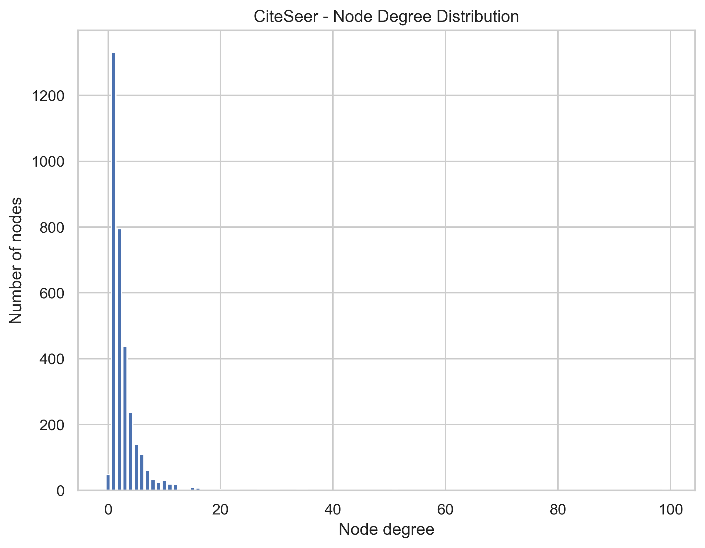
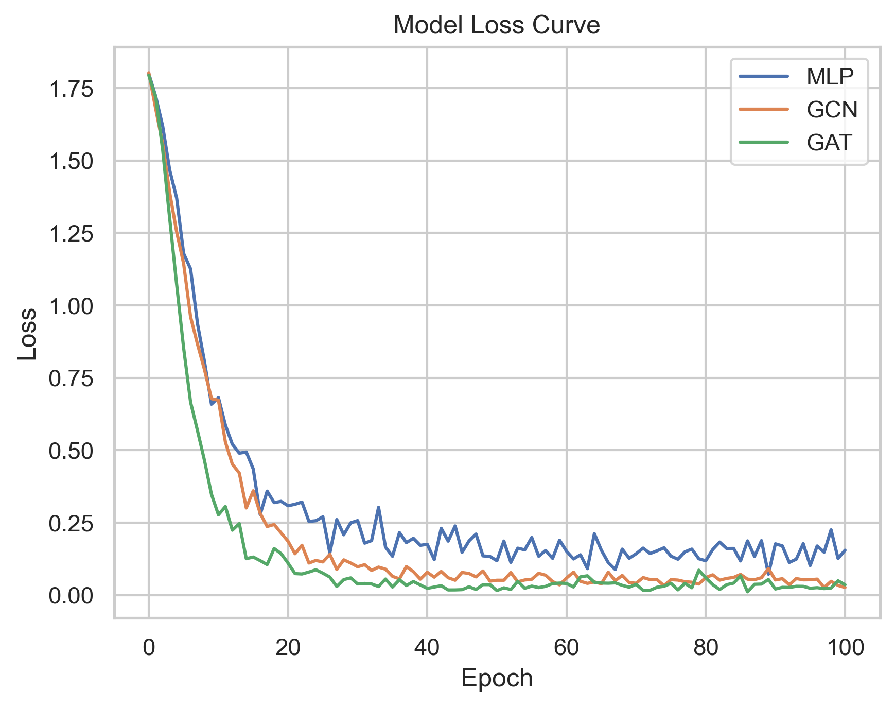
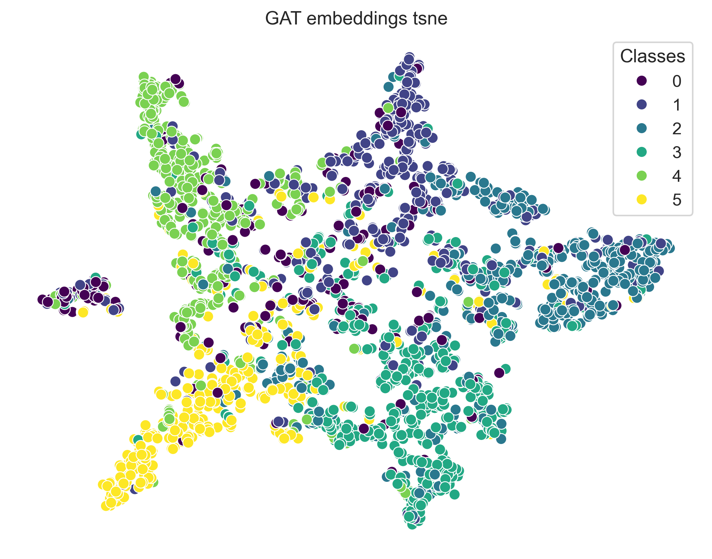

# Graph Neural Networks for Node Classification on CiteSeer

End-to-end graph node classification using Graph Neural Networks (GCN and GAT) implemented with PyTorch Geometric. This project explores graph data through exploratory analysis, compares deep learning models with an MLP baseline, and visualizes learned node embeddings using t-SNE.

---

## Objective

The objective of this project is to investigate how Graph Neural Networks leverage graph structure to improve node classification performance compared with a traditional Multi-Layer Perceptron (MLP) baseline.

---

## Project Overview

This project implements an end-to-end graph machine learning workflow on the CiteSeer citation network.

The workflow includes:

- Exploratory graph data analysis (EDA)
- Graph statistics and visualization
- Multi-Layer Perceptron (MLP) baseline
- Graph Convolutional Network (GCN)
- Graph Attention Network (GAT)
- Model training and validation
- Performance evaluation
- Node embedding visualization using t-SNE

---

## Dataset

**Dataset:** CiteSeer Citation Network

The CiteSeer citation network consists of scientific publications connected through citation relationships.

- **Nodes:** Scientific publications
- **Edges:** Citation relationships
- **Node Features:** Bag-of-words representation of each publication
- **Task:** Multi-class node classification

The dataset is widely used as a benchmark for evaluating Graph Neural Network models.

### References

- https://link.springer.com/chapter/10.1007/978-3-319-06028-6_26
- https://docs.dgl.ai/en/0.8.x/generated/dgl.data.CiteseerGraphDataset.html

---

## Workflow

```text
Load CiteSeer Dataset
        │
        ▼
Exploratory Graph Analysis
        │
        ▼
Graph Statistics & Visualization
        │
        ▼
MLP Baseline
        │
        ▼
Graph Convolutional Network (GCN)
        │
        ▼
Graph Attention Network (GAT)
        │
        ▼
Model Training & Validation
        │
        ▼
Performance Evaluation
        │
        ▼
Node Embedding Visualization (t-SNE)
```

---

## Technologies

- Python
- PyTorch
- PyTorch Geometric
- NumPy
- NetworkX
- Scikit-learn
- Matplotlib

---

## Project Structure

```
gnn-on-citeseer
│
├── README.md
├── citeseer_code.ipynb
└── figures/
```

---

## Results

This project compares three different approaches for node classification:

| Model | Description |
|-------|-------------|
| MLP | Baseline model using only node features |
| GCN | Graph Convolutional Network utilizing neighborhood aggregation |
| GAT | Graph Attention Network with attention-based message passing |

Key observations:

- Graph Neural Networks outperform the traditional MLP baseline by leveraging graph connectivity.
- GAT introduces attention mechanisms to learn the relative importance of neighboring nodes.
- Learned node embeddings exhibit improved class separation after graph-based representation learning.

---

## Graph Statistics

The degree distribution shows that most nodes have relatively few connections, while a small number of nodes serve as highly connected hubs.



---

## Training Performance

The loss curves indicate that GCN and GAT converge faster than the MLP baseline.



---

## Learned Node Embeddings (GAT)

The learned node embeddings demonstrate improved class separation after graph-based representation learning.



## Skills Demonstrated

This project demonstrates practical experience with:

- Graph Neural Networks (GCN & GAT)
- Deep Learning with PyTorch
- PyTorch Geometric
- Graph Data Analysis
- Node Classification
- Representation Learning
- Model Training & Evaluation
- Graph Visualization
- Dimensionality Reduction (t-SNE)

---

## Future Improvements

Potential extensions include:

- Hyperparameter optimization
- GraphSAGE implementation
- Link prediction tasks
- Graph classification
- Experiments on larger benchmark graph datasets

---

## Acknowledgements

This project uses the CiteSeer citation network provided through the PyTorch Geometric ecosystem and is inspired by benchmark graph learning tasks commonly used in graph machine learning research.
